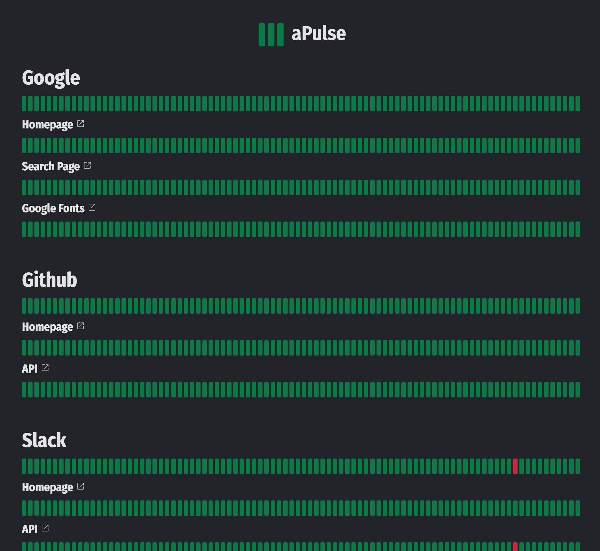

# aPulse
A one-file NodeJS server status monitoring/notification tool.

# Demo
Visit https://apulse.ybouane.com for a demo!

[](https://apulse.ybouane.com)

# Features
- Highly and easily configurable, edit the config.js file to add test endpoints and configure the watcher
- Supports sending outage notifications by: Telegram, Discord, Slack, SMS (Twilio API), Email (SendGrid API)
- Uses the Fetch API to test server-responses, you can configure GET, POST, PUT... requests and have full control over the fetch options.
- Check content for validity, HTTP status...
- Measures latency
- Minimal and easy to use dashboard
- Easy to setup. Run the watcher.js script and open the static/index.html page to view the dashboard.
- Auto-reload of the config file (no need to restart the watcher)
- No dependencies


# How does it work
aPulse can be configured through the "config.js" file and it looks like this
```javascript
export default {
	interval			: 15, // Interval in minutes between each pulse
	nDataPoints			: 90, // Number of datapoints to display on the dashboard
	responseTimeGood	: 300, // In milliseconds, this and below will be green
	responseTimeWarning	: 600, // In milliseconds, above this will be red
	timeout				: 5000, // In milliseconds, requests will be aborted above this
	verbose				: true, // Whether or not to output pulse messages in the console
	readableStatusJson	: true, // Format status.json to be human readable
	logsMaxDatapoints	: 200, // Maximum datapoints history to keep (per endpoint)
	telegram			: {}, // optional, tokens to send notifications through telegram
	slack				: {}, // optional, tokens to send notifications through slack
	discord				: {}, // optional, tokens to send notifications through discord
	twilio				: {}, // optional, tokens to send notifications through twilio (SMS)
	sendgrid			: {}, // optional, tokens to send notifications through sendgrid (Email)
	consecutiveErrorsNotify			: 1, // After how many consecutive Errors events should we send a notification
	consecutiveHighLatencyNotify	: 3, // After how many consecutive High latency events should we send a notification
	sites				: [ // List of sites to monitor
		{
			id				: 'google', // optional
			name			: 'Google',
			endpoints		: [ // Each site is a bunch of endpoints that can be tested
				{
					id				: 'homepage', // optional
					name			: 'Homepage', // optional
					link			: 'https://www.google.com', // optional, for notifications and dashboard only, [defaults to endpoint.url], can be disabled by setting it to false
					url				: 'https://www.google.com', // required
					request			: { // optional, fetch options
						method: 'GET',
					},
					mustFind		: 'Feeling Lucky', // optional, String | Array | Regex | Function | AsyncFunction
					mustNotFind		: /Page not found/i, // optional, String | Array | Regex | Function | AsyncFunction
					customCheck		: async (content, response)=>{return true;}, // optional, Function | AsyncFunction -> Run your own custom checks return false in case of errors
					validStatus		: [200], // optional, Which http status should be considered non errors [defaults to 200-299]
				}
			]
		}
	],
};
```

# Installation
Clone the repo:
```shell
git clone https://github.com/ybouane/aPulse.git
```

Either run the watcher.js script directly (you need to keep it running in the background)
```shell
cd aPulse
```
```shell
node watcher.js
```

Or use a tool like PM2 (prefered method):
```shell
npm install pm2 -g
```
Start watcher.json
```shell
pm2 start pm2.json
```
Configure pm2 to automatically start during startup
```shell
pm2 startup
```
Save current pm2 processes list
```shell
pm2 save
```
